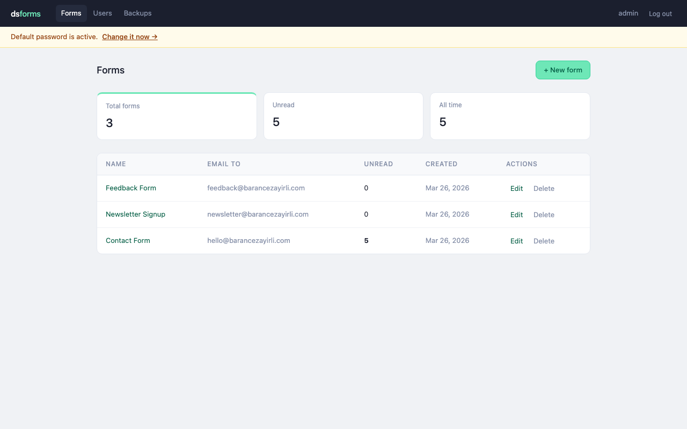
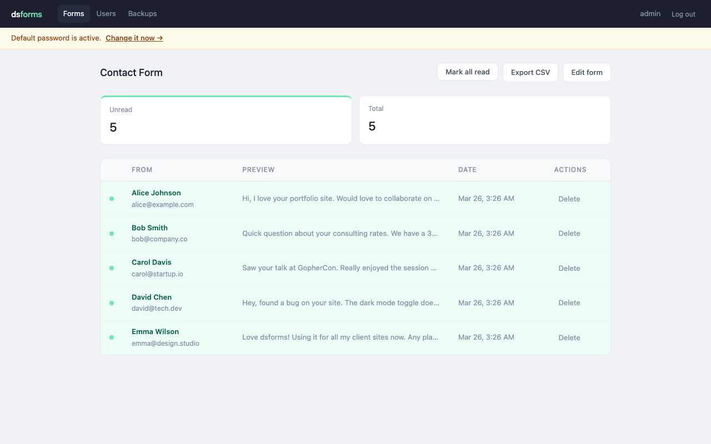

# dsforms

A self-hosted form endpoint for static websites. One binary. SQLite. Your data stays with you.



---

## Why dsforms?

If you have a static site — Jekyll, Hugo, Astro, plain HTML — you need somewhere to send your `<form>` submissions. Services like web3forms work, but your data lives on someone else's server and you're locked into their UX.

dsforms gives you a form backend you fully own. Drop it on a $5 VPS, point your forms at it, and you're done. Every submission is stored in a local SQLite database that you can export, back up, or query directly. No per-submission fees, no vendor lock-in, no surprise pricing changes.

**It's intentionally simple.** One Go binary. One Docker Compose command. No Redis, no Postgres, no external dependencies.

## Features

- **Webhook notifications** to Slack, Discord, or any URL (generic JSON)
- **Email notifications** on every submission (any SMTP provider)
- **Admin UI** to view, search, and manage submissions
- **CSV export** for spreadsheets and data analysis
- **Honeypot + rate limiting** built in (no CAPTCHA needed)
- **DB backup & restore** from the admin UI (download/upload .db files)
- **CLI tools** for user management from inside the container
- **Single binary** — no runtime dependencies, ~20MB Docker image
- **MIT licensed** — do whatever you want with it



## Docker Image

Pre-built images are published to GitHub Container Registry on every release:

```yaml
services:
  dsforms:
    image: ghcr.io/barancezayirli/dsforms:latest
    restart: unless-stopped
    ports:
      - "8080:8080"
    volumes:
      - dsforms_data:/data
    environment:
      - SECRET_KEY=your-secret-key
      - BASE_URL=https://forms.yourdomain.com
      - SMTP_HOST=smtp.example.com
      - SMTP_PORT=587
      - SMTP_USER=you@example.com
      - SMTP_PASS=your-password
      - SMTP_FROM=DSForms <noreply@example.com>

volumes:
  dsforms_data:
```

You can pin to a specific version (e.g. `ghcr.io/barancezayirli/dsforms:1.2.3`) or use `latest` for the most recent release.

## Quick Start (from source)

### 1. Clone and configure

```bash
git clone https://github.com/barancezayirli/dsforms.git
cd dsforms
cp .env.example .env
```

Edit `.env` — at minimum, set `SECRET_KEY`:

```bash
# Generate a random secret
openssl rand -base64 32
```

### 2. Start with Docker Compose

**Development** (includes Mailpit for email testing):

```bash
make dev-up
# App:    http://localhost:8080
# Emails: http://localhost:8025 (Mailpit web UI)
```

**Production:**

```bash
make docker-up
# App: http://localhost:8080
```

### 3. Log in

Default credentials: `admin` / `admin`

You'll see a warning banner until you change the password at **Account Settings**.

### 4. Create a form

Go to **Forms → + New form**, enter a name and the email where you want notifications sent.

### 5. Paste the snippet into your HTML

```html
<form action="https://your-server.com/f/YOUR_FORM_ID" method="POST">
  <input type="text"   name="name"    placeholder="Your name"    required>
  <input type="email"  name="email"   placeholder="Your email"   required>
  <textarea            name="message" placeholder="Your message" required></textarea>
  <button type="submit">Send</button>
</form>
```

That's it. Submissions show up in the admin UI and trigger email notifications.

## HTML Form Options

Add these hidden fields to customize behavior:

| Field | Purpose |
|-------|---------|
| `_redirect` | URL to redirect the user after submission |
| `_honeypot` | Hidden spam trap — bots fill it, humans don't |
| `_subject` | Custom email notification subject line |

**Honeypot example:**

```html
<input type="text" name="_honeypot" style="display:none" tabindex="-1" autocomplete="off">
```

**JSON API:**

Send `Accept: application/json` to get a JSON response instead of a redirect:

```bash
curl -X POST https://your-server.com/f/FORM_ID \
  -H "Accept: application/json" \
  -d "name=Alice&email=alice@example.com&message=Hello"

# {"success": true}
```

## Configuration

All configuration is via environment variables in `.env`:

| Variable | Required | Default | Description |
|----------|----------|---------|-------------|
| `SECRET_KEY` | Yes | — | Random string for signing flash cookies. Generate with `openssl rand -base64 32` |
| `SMTP_HOST` | Yes | — | SMTP server hostname |
| `SMTP_PORT` | No | `587` | SMTP port |
| `SMTP_USER` | No | — | SMTP username (empty for auth-free servers like Mailpit) |
| `SMTP_PASS` | No | — | SMTP password |
| `SMTP_FROM` | Yes | — | From address for notifications, e.g. `DSForms <noreply@example.com>` |
| `LISTEN_ADDR` | No | `:8080` | HTTP listen address |
| `BASE_URL` | No | — | Public URL (used for `Secure` cookie flag and email links) |
| `DB_PATH` | No | `/data/dsforms.db` | SQLite database path |
| `RATE_BURST` | No | `5` | Max form submissions per IP in a burst |
| `RATE_PER_MINUTE` | No | `6` | Sustained submission rate per IP per minute |
| `BACKUP_LOCAL_DIR` | No | — | Directory for CLI backup snapshots |

### SMTP Providers

The `.env.example` includes ready-to-use examples for:

- **Mailpit** (development — included in `docker-compose.dev.yml`)
- **Gmail** (free with App Password)
- **Resend** (free 3k emails/month)
- **Brevo** (free 300 emails/day)

## Managing Users

### From the admin UI

Go to **Users** to add, remove, or manage users. Change your own password at **Account Settings**.

### From the command line

Useful for resetting a forgotten password from inside the container:

```bash
# List users
docker compose exec dsforms ./dsforms user list

# Add a user
docker compose exec dsforms ./dsforms user add alice secretpassword

# Reset a password
docker compose exec dsforms ./dsforms user set-password admin newpassword

# Delete a user
docker compose exec dsforms ./dsforms user delete alice
```

## Backups

### From the admin UI

Go to **Backups** to download a full database snapshot (`.db` file) or restore from a previous backup.

### From the command line

```bash
# Set BACKUP_LOCAL_DIR in .env first
docker compose exec dsforms ./dsforms backup create
```

The backup is a standard SQLite file. You can open it with any SQLite client or use it as a direct replacement for the live database.

## Reverse Proxy

For production, put dsforms behind a reverse proxy for TLS termination.

**Nginx:**

```nginx
server {
    listen 443 ssl;
    server_name forms.example.com;

    ssl_certificate     /etc/letsencrypt/live/forms.example.com/fullchain.pem;
    ssl_certificate_key /etc/letsencrypt/live/forms.example.com/privkey.pem;

    location / {
        proxy_pass http://127.0.0.1:8080;
        proxy_set_header Host $host;
        proxy_set_header X-Real-IP $remote_addr;
        proxy_set_header X-Forwarded-For $proxy_add_x_forwarded_for;
        proxy_set_header X-Forwarded-Proto $scheme;
    }
}
```

**Caddy:**

```
forms.example.com {
    reverse_proxy localhost:8080
}
```

Set `BASE_URL=https://forms.example.com` in `.env` so session cookies get the `Secure` flag.

## Development

```bash
# Run locally (needs Go 1.25+)
cp .env.example .env
SECRET_KEY=dev SMTP_HOST=localhost SMTP_PORT=1025 SMTP_FROM="Dev <dev@test.com>" go run .

# Run tests
make test

# Build binary
make build
```

### Project Structure

```
dsforms/
├── main.go                    # CLI dispatch + server wiring
├── internal/
│   ├── config/                # Environment variable loading
│   ├── store/                 # SQLite operations (all DB access)
│   ├── auth/                  # Session tokens + RequireAuth middleware
│   ├── flash/                 # One-time flash messages
│   ├── mail/                  # SMTP notifications
│   ├── ratelimit/             # Token bucket + login guard
│   ├── backup/                # Export (VACUUM INTO) + import (atomic swap)
│   └── handler/               # HTTP handlers
├── templates/                 # Go html/template files
├── Dockerfile                 # Multistage build
├── docker-compose.yml         # Production
└── docker-compose.dev.yml     # Dev (adds Mailpit)
```

### Tech Stack

- **Go** — single binary, no runtime dependencies
- **SQLite** via [modernc.org/sqlite](https://pkg.go.dev/modernc.org/sqlite) — pure Go, no CGO
- **chi** — lightweight HTTP router
- **html/template** — server-rendered, no JS framework
- Vanilla JS only for copy-to-clipboard and mobile nav toggle

## Security

- Session tokens stored as SHA-256 hashes in the database (cookie leak doesn't expose sessions)
- Password change invalidates all sessions across all devices
- bcrypt at cost 12 for all passwords
- HMAC-SHA256 signed flash cookies
- Rate limiting on form submissions (per-IP token bucket)
- Login brute-force protection (5 attempts, 15-minute lockout)
- `HttpOnly`, `SameSite=Lax`, conditional `Secure` on all cookies
- Security headers: `X-Content-Type-Options`, `X-Frame-Options`, `Referrer-Policy`, `CSP`
- Honeypot field for spam prevention
- 64KB request body limit (100MB for backup import only)

## License

MIT — see [LICENSE](LICENSE).

## Credits

Built by [Baran Cezayirli](https://barancezayirli.com).

If you find this useful, [give it a star](https://github.com/barancezayirli/dsforms) and share it with someone who needs a simple form backend.
