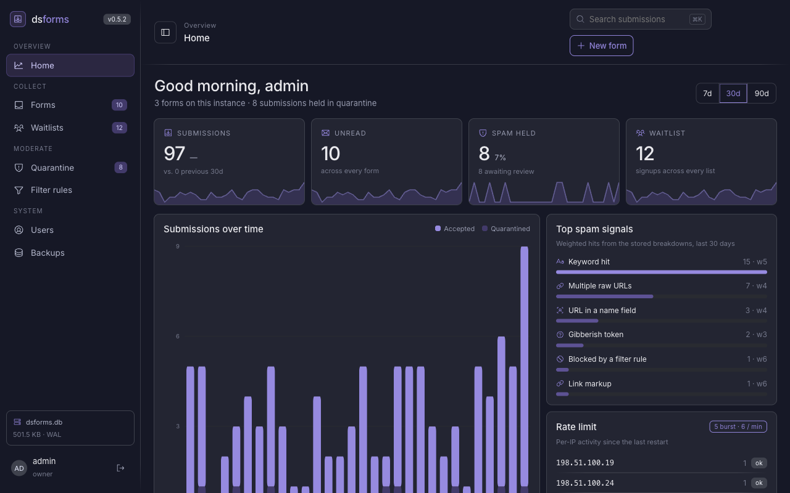
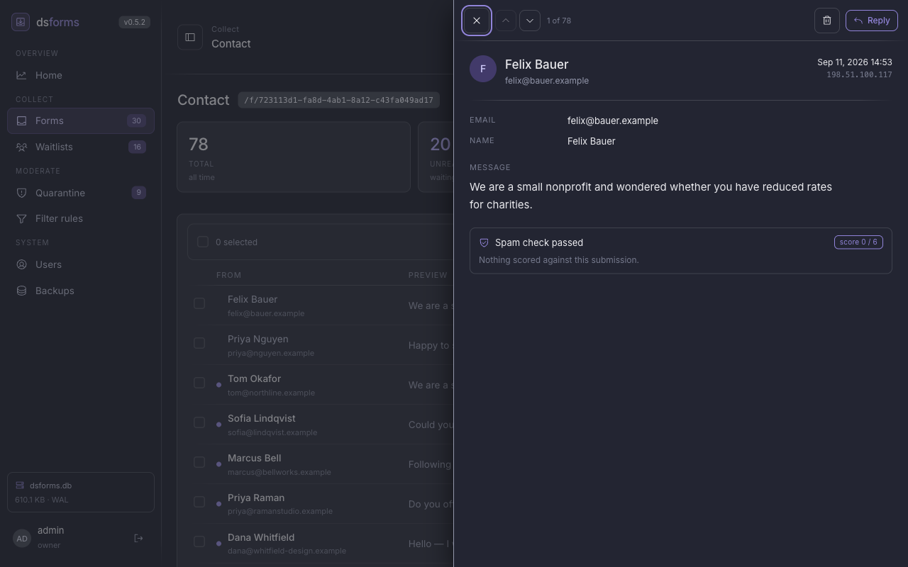

<div align="center">

# dsforms

**A self-hosted form backend for static sites. One binary, one SQLite file, your data.**

[](https://github.com/barancezayirli/dsforms/actions/workflows/test.yml)
[](https://github.com/barancezayirli/dsforms/releases)
[](LICENSE)
[](go.mod)
[](https://github.com/barancezayirli/dsforms/pkgs/container/dsforms)

[Quick start](#quick-start) · [Documentation](docs/) · [Live demo of the UI](https://barancezayirli.github.io/dsforms/)

</div>



## Why

You have a static site — Hugo, Astro, Jekyll, hand-written HTML — and a
`<form>` that needs somewhere to POST. The hosted services work, but your
submissions live on someone else's server, priced per submission, and you find
out about the pricing change with everyone else.

dsforms is the boring alternative you run yourself. Point your form at it and
every submission lands in a SQLite file on a $5 VPS that you can copy, query or
delete. No per-submission fee, no vendor, no Redis, no Postgres.

It is deliberately small: **one Go binary, one file, no runtime dependencies.**

## Features

- **Spam quarantine, not a bin.** Submissions are scored and held with the
  breakdown that held them, so a false positive is one click from your inbox
  instead of gone. Link markup, keywords, injection probes, repeat-IP activity
  and synthetic tokens all feed a score you can tune per form.
- **Filter rules** — block an address, domain, IP or CIDR; allowlist the
  customer the filter keeps catching. Allow always beats block.
- **Email and webhooks** — SMTP notifications, plus Slack, Discord or generic
  JSON on every submission.
- **Waitlists** — unique signups by email, positions, confirmation emails, and
  a restart-safe broadcast when you launch.
- **Admin UI** with search, bulk actions, CSV export and a reading drawer.
- **Backups that fail safely** — download or restore a snapshot from the UI; a
  failed restore puts the original back rather than leaving you with nothing.
- **Honeypot, rate limiting and login lockout** built in. No CAPTCHA.
- **CLI** for user management and snapshots from inside the container.
- **~20MB image**, health check included.



## Quick start

```bash
docker run -d --name dsforms -p 8080:8080 \
  -e SECRET_KEY="$(openssl rand -base64 32)" \
  -v dsforms_data:/data \
  ghcr.io/barancezayirli/dsforms:latest
```

Open <http://localhost:8080>, log in with **`admin` / `admin`**, and change the
password when it tells you to.

Prefer Compose, or want email working? See **[Deployment](docs/deployment.md)**.
Building from source is `make dev-up`, which brings up Mailpit on `:8025` so you
can see the notification emails.

### Point a form at it

Create a form in the admin, then paste the snippet it gives you:

```html
<form action="https://your-server.com/f/YOUR_FORM_ID" method="POST">
  <input type="text"   name="name"    placeholder="Your name"    required>
  <input type="email"  name="email"   placeholder="Your email"   required>
  <textarea            name="message" placeholder="Your message" required></textarea>
  <button type="submit">Send</button>
</form>
```

That is the whole integration. Submissions appear in the admin and trigger
whatever notifications you configured.

## HTML form options

Add these hidden fields to change what happens:

| Field | Purpose |
|-------|---------|
| `_redirect` | Where to send the visitor after submitting — see below |
| `_honeypot` | Hidden spam trap — bots fill it, humans don't |

```html
<input type="text" name="_honeypot" style="display:none" tabindex="-1" autocomplete="off">
```

**Redirect rules.** `_redirect` comes from the browser, so it is not trusted on
its own. It is accepted when it is a path on this instance, a URL on the same
origin as the form's configured **Redirect after submit**, or a URL on the same
origin as `BASE_URL`. Anything else is ignored and the visitor goes to the
form's configured redirect, or the built-in success page — the submission is
still stored and handled normally, because a redirect the server will not follow
is no reason to lose someone's message.

In practice: set **Redirect after submit** to a URL on your own site, and
`_redirect` then works for any page on it. Without that rule anyone could use
your endpoint to bounce visitors from your domain to theirs.

**JSON instead of a redirect** — send `Accept: application/json`:

```bash
curl -X POST https://your-server.com/f/FORM_ID \
  -H "Accept: application/json" \
  -d "name=Alice&email=alice@example.com&message=Hello"

# {"success": true}
```

## Documentation

| | |
|---|---|
| **[Configuration](docs/configuration.md)** | Every environment variable, SMTP providers, spam filtering |
| **[Deployment](docs/deployment.md)** | Docker, reverse proxy, TLS, health checks |
| **[Operations](docs/operations.md)** | Users, backups, and what happens when a restore fails |
| **[Waitlists](docs/waitlists.md)** | Signups, positions, confirmations, broadcasts |
| **[Development](docs/development.md)** | Building, testing, project layout |

## Security

- Session tokens stored as SHA-256 hashes — a leaked cookie does not expose the session
- Changing a password invalidates every session on every device
- bcrypt at cost 12, minimum 12 characters, enforced in the store so it covers the UI and both CLI commands
- HMAC-SHA256 signed flash cookies; `HttpOnly`, `SameSite=Lax`, conditional `Secure`
- Per-IP rate limiting on submissions, and a 5-attempt / 15-minute login lockout
- `X-Content-Type-Options`, `X-Frame-Options`, `Referrer-Policy` and a CSP
- 64KB request body limit (100MB for backup import only)

Found something? Please report it privately — see **[SECURITY.md](SECURITY.md)**.

## Contributing

Issues and pull requests are welcome. **[CONTRIBUTING.md](CONTRIBUTING.md)** is
short; [`AGENT.md`](AGENT.md) is the real working agreement and worth a read
before a first patch, particularly the testing section.

## Licence

**[AGPL-3.0](LICENSE).** You can run it, modify it and self-host it freely. If
you modify dsforms and offer it to others as a network service, you have to
publish your changes under the same licence.

For the overwhelmingly common case — running it for yourself or your clients —
this asks nothing of you that MIT did. Releases up to and including **v0.5.2**
were published under MIT and stay available under those terms; the change
applies from the next release onward.

## Support

Built by [Baran Cezayirli](https://barancezayirli.com). If dsforms saves you a
subscription, a [coffee](https://buymeacoffee.com/barancezayirli) is very
welcome — and a ⭐ helps other people find it.

<a href="https://buymeacoffee.com/barancezayirli"></a>
